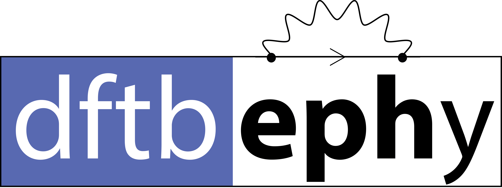

# DFTBephy
Calculating electron-phonon couplings (EPCs) with DFTB.

For more information see our articles:
> Croy, A., Unsal, E., Biele, R., Pecchia A. *DFTBephy: A DFTB-based approach for electron–phonon coupling calculations.* J Comput Electron, 22, 1231 (2023). 
> doi:10.1007/s10825-023-02033-9 
> [full-text access](https://link.springer.com/article/10.1007/s10825-023-02033-9)

> Unsal, E., Pecchia A., Croy, A., Cuniberti, G. *Charge carrier mobilities in γ-graphynes: a computational approach.* Nanoscale, 17, 24591 (2025). 
> doi:10.1039/D5NR02989A
> [full-text access](https://pubs.rsc.org/en/content/articlelanding/2025/nr/d5nr02989a)

The BibTeX entries are available in [`references.bib`](https://github.com/CoMeT4MatSci/dftbephy/blob/master/references.bib).

## DFTBephy Wiki 

Our [wiki page](https://comet4matsci.github.io/dftbephy/main/about.html) provides guidance on installing and running DFTBephy, reproducing the Graphene example, and following the workflow from band structures to electron–phonon coupling, scattering rates, and transport properties. It also includes detailed documentation of the input files.

# Prerequisites

- numpy and scipy
- [dftb+](https://github.com/dftbplus/dftbplus)
- [phonopy](https://github.com/phonopy/phonopy) (`conda install -c conda-forge phonopy`)
- cython (`pip install Cython`) for faster routines.
- Other packages might be necessary: mpi4py, openmpi, spglib, h5py, [hsd](https://github.com/dftbplus/hsd-python) 

# Installation

- Pull / download latest version from github.
- Run `python setup.py build_ext --inplace` in the terminal to build faster routines.
- Run `pip install -e .` in the terminal to install package but keep it editable in the current directory.

# Running calculations

- Starting point for all DFTBephy calculations is a finished phonopy calculation of the force constants (e.g. FORCE_SETS and phonopy_disp.yaml).
- The working directory should contain a dftb_in.hsd file, which reads the geometry from geo.gen (will be written by DFTBephy) and contains the option `WriteHS = Yes` (to be used by DFTBephy). The directory may also contain charges.bin from a previous SCC run.
- See the examples/ directory for more details. (It's recommended to copy one of the examples and adapt it to your needs.)
- Detailed information about DFTBephy input (dftbephy_in.hsd) can be found [here][dftbephyinput] and on the [wiki](https://comet4matsci.github.io/dftbephy/documentation/inputfile.html).

# What you can get
The main purpose of DFTBephy is the calculation of electron-phonon couplings. Apart from that, the package also allows the calculation of the electronic band-structure and the electron scattering rate (at the moment only within SERTA). The [scripts/](https://github.com/CoMeT4MatSci/dftbephy/blob/master/scripts) directory contains some programs and templates for computing
- EPCs at k-point on a (fine) q-mesh -- [dftbephy-epc.py](https://github.com/CoMeT4MatSci/dftbephy/blob/master/scripts/dftbephy-epc.py) -- the result is stored in a hdf5 file;
- EPCs along a given q-path  -- [dftbephy-ephline.py](https://github.com/CoMeT4MatSci/dftbephy/blob/master/scripts/dftbephy-ephline.py) -- the results are stored in a json file;
- Relaxation times on a (fine) k-mesh -- [dftbephy-relaxationtimes-mpi.py](https://github.com/CoMeT4MatSci/dftbephy/blob/master/scripts/dftbephy-relaxationtimes-mpi.py) -- the results are stored in a hdf5 file;
- Conductivity tensor -- [dftbephy-mobility-mpi.py](https://github.com/CoMeT4MatSci/dftbephy/blob/master/scripts/dftbephy-mobility-mpi.py) -- the results are stored in a json file. For this script, spglib is required.

See jupyter notebooks in [notebooks/](https://github.com/CoMeT4MatSci/dftbephy/tree/master/notebooks) for how to read, use and visualize the output.

[//]: # (These are reference links used in the body of this note and get stripped out when the markdown processor does its job.- http://stackoverflow.com/questions/4823468/store-comments-in-markdown-syntax)

[dftbephyinput]: <https://github.com/CoMeT4MatSci/dftbephy/blob/master/Input_for_DFTBephy.md>
